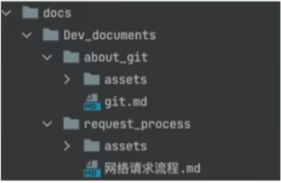

# 基于MKdocs搭建个人wiki

## 1.安装mkdocs
`pip install mkdocs`

安装&配置主题
`pip install mkdocs-material`
```
theme:
    name: 'material'
```

## 2.创建项目
```
mkdocs new my-wiki
cd my-wiki
```
预览项目，首先进入`my-wiki`文件夹下，运行`mkdocs serve`命令
```
cd my-wiki
mkdocs serve
```

## 3.页面布局
导航栏支持多级布局，详见👉
[mkdocs开发文档教程](https://mkdocs-like-code.readthedocs.io/zh-cn/latest/)
```
nav: 
    - Home: index.md
    - User Guide:
        - num_1: 1.md
        - num_2: 2.md
    - About
        - xx: 3.md
        - xx: 4.md
```

```
nav:
    - Home: index.md
    - Dev_documents:
        - Dev_documents/about_git/git.md
        - Dev_documents/request_process/网络请求.md
```

## 4.部署wiki到github并发布
- 在github中创建自己的仓库
- 在本地做完相对应的git操作后push到远程仓库
`git push origin master`
- 进入`my-wiki`文件夹，进行部署
```
cd ./my-wiki/
mkdocs gh-deploy
```